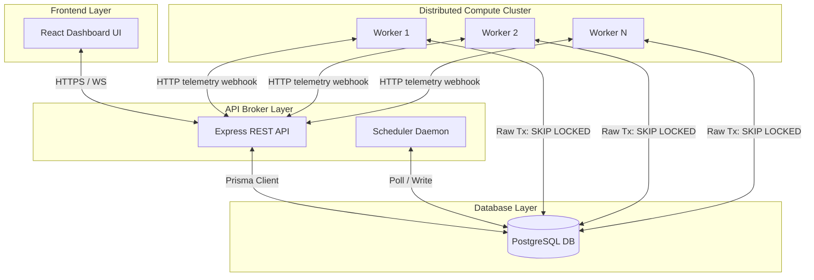
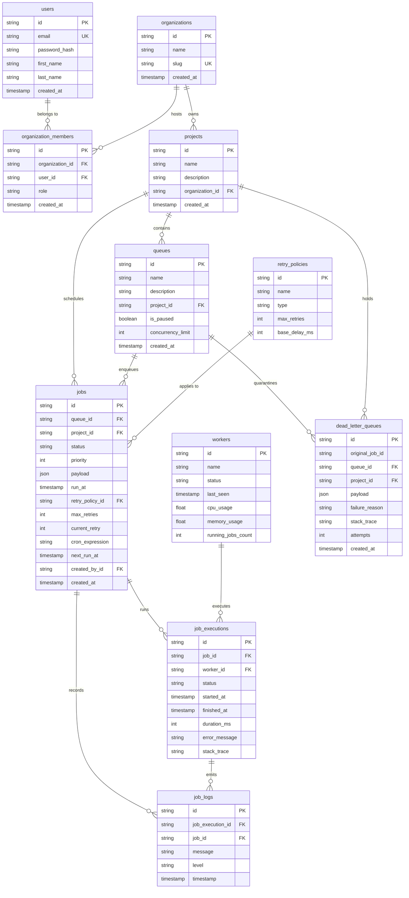
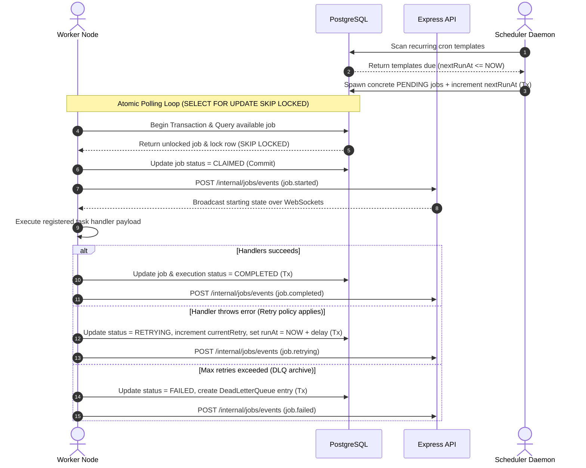

# Distributed Job Scheduler

A high-performance, containerized, distributed job scheduler utilizing atomic database locking for secure concurrent execution. Built as a TypeScript monorepo combining an Express REST API backend, independent polling worker processes, and a glassmorphic React dashboard frontend.

---

## 🏗️ Architecture Design



---

## 🗄️ Database Entity Relationship (ER) Model



---

## ⚡ Job Claiming & Execution Sequence



---

## 📡 API Reference Documentation

All endpoints (except auth routes) expect a `Bearer <token>` inside the `Authorization` header.

### 1. Authentication
- `POST /auth/register` - Creates a new user account.
- `POST /auth/login` - Validates credentials; returns access/refresh JWT tokens.
- `POST /auth/refresh` - Emits a new access token using a refresh token.
- `GET /auth/me` - Profile overview of the active session.

### 2. Organizations & Projects
- `POST /organizations` - Create a new org (creator automatically gains OWNER role).
- `GET /organizations` - Lists org memberships for the user.
- `POST /organizations/:orgId/members` - Invite/assign member roles (`OWNER`, `ADMIN`, `DEVELOPER`, `VIEWER`).
- `POST /projects` - Create a project in an org (requires OWNER/ADMIN).
- `GET /projects` - Lists projects with filtering, sorting, and search.

### 3. Queues & Jobs
- `POST /queues` - Initialize a queue (supports custom concurrency limits).
- `PUT /queues/:queueId/pause` - Pauses polling execution in a queue.
- `PUT /queues/:queueId/resume` - Resumes polling execution in a queue.
- `GET /queues/:queueId/stats` - Returns counts by job status (PENDING, RUNNING, etc.).
- `POST /jobs` - Enqueue an immediate, delayed (`delaySeconds`), or recurring (`cronExpression`) job.
- `POST /jobs/batch` - Enqueue a batch of jobs inside a transaction.
- `GET /jobs/:jobId` - Detailed diagnostics showing raw payload, executions, and execution log streams.

### 4. Metrics & Operations
- `GET /metrics?projectId=<id>` - Aggregated dashboards counters and throughput trends.
- `GET /workers` - Active worker nodes cluster status and telemetry load.
- `GET /dlq?projectId=<id>` - Audit dead letter queue logs.
- `POST /dlq/:dlqId/retry` - Re-enqueue a failed job and delete its quarantine record.

---

## ⚙️ Running Locally

### Prerequisites
- Node.js (v18+)
- Docker & Docker Compose (optional, for local DB)

### 1. Database Setup
Spin up PostgreSQL via Docker:
```bash
npm run db:up
```
If you do not have Docker installed, configure a local PostgreSQL instance and set `DATABASE_URL` in `backend/.env`. Then run migrations and generate client:
```bash
npm run db:migrate
npm run db:generate
```

### 2. Install & Start Server
Install all dependencies for workspaces from the monorepo root:
```bash
npm install
```

Start the Express API server (port 3001) and background scheduler:
```bash
npm run backend:dev
```

### 3. Start Workers
Start one or more compute worker processes:
```bash
npm run worker:dev
```

### 4. Start Dashboard UI
Start the React Vite dashboard (port 3000):
```bash
npm run frontend:dev
```

---

## 📈 Design Trade-offs & Performance Considerations

1. **Database-Backed Queue (SKIP LOCKED)**: Using Postgres as a message broker avoids the complexity of running Redis (BullMQ) or RabbitMQ. Using `FOR UPDATE SKIP LOCKED` prevents race conditions where multiple workers try to claim the same task. However, this is bounded by Postgres CPU/disk write throughput. For scale beyond 10,000 jobs/sec, a dedicated broker (Kafka/RabbitMQ) should be adopted.
2. **Stateless JWTs vs Session Stores**: Using stateless JWTs speeds up auth validation without querying the DB on every HTTP call. Token revocation is handled by client-side purge. For strict immediate logout, a Redis blacklist cache would represent a future enhancement.
3. **Local Concurrency Promise Pool**: Workers limit local concurrency using a Promise Pool to prevent host CPU exhaustion, while queue concurrency is managed globally in Postgres queries. This guarantees distributed rate limits are respected even with many active workers.
